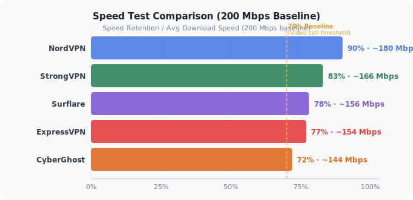
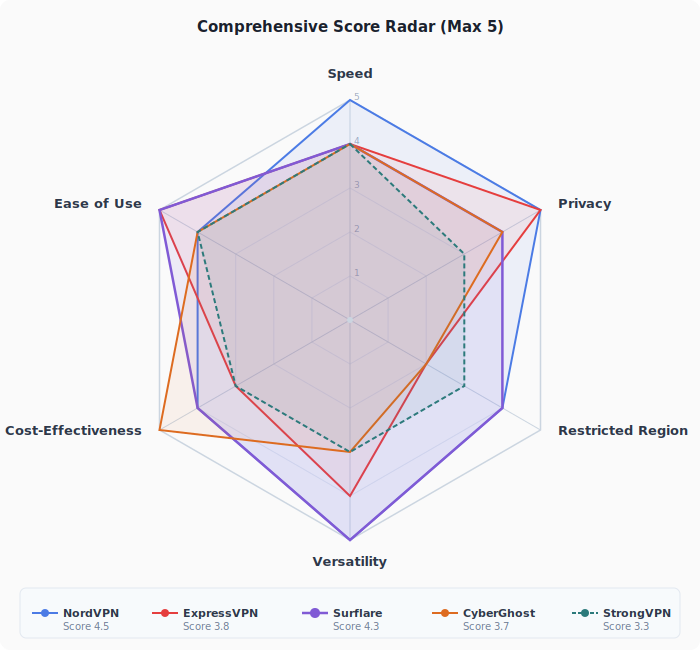

# 2026 年 VPN 深度测评：五款主流产品横向对比

**语言版本 / Languages：** [🇺🇸 English](https://github.com/NxxForbes/best-vpn-for-productivity) · 🇨🇳 中文（当前）· [🇷🇺 Русский](https://github.com/NxxForbes/best-vpn-for-productivity-ru) · [🇸🇦 العربية](https://github.com/NxxForbes/best-vpn-for-productivity-ar)

---

## 目录

1. [摘要](#一摘要)
2. [五款产品简介速览](#二五款产品简介速览)
3. [速度与稳定性](#三速度与稳定性)
4. [隐私与功能](#四隐私与功能)
5. [实用场景测试](#五实用场景测试)
6. [价格与性价比](#六价格与性价比)
7. [综合评分汇总](#七综合评分汇总)
8. [快速选择指南](#八快速选择指南)
9. [常见问题 FAQ](#九常见问题-faq)
10. [免责声明](#十免责声明)

---

## 一、摘要

本文是一篇面向**有实际工作需求的成年用户**的 VPN 横向测评，不适合寻找免费翻墙工具或只有娱乐需求的读者。

**本文解决什么问题**

市面上 VPN 测评文章多以广告为驱动，评分维度单一，难以回答「我这个具体场景该用哪款」。本文从五个真实工作场景出发——远程办公、AI 工具访问、流媒体直播、多账号运营、团队管理——逐一对比五款主流产品的实际表现，并给出明确的场景推荐。

**面向读者**

- 远程办公或长期出差的商务人士，依赖 Zoom、Google Workspace、Slack
- 内容创作者，有 YouTube / TikTok 直播或 AI 工具访问需求
- 跨境电商、TikTok / 社媒矩阵运营者，需要管理多个平台账号
- 5 人以上团队的技术负责人或运营主管，需要统一管理员工网络出口

**测评方法**

速度、隐私、管控地区连接数据均来自第三方测评并结合自测；场景分析与产品对比基于各官网公示规格及功能文档，本文保持客观中立立场。

---

## 二、五款产品简介速览

| 产品 | 成立时间 | 注册地 | 服务器规模   | 一句话定位 |
|------|---------|--------|---------|----------|
| **[NordVPN](https://nordvpn.com)** | 2012 年 | 巴拿马 | 130 个国家 | 速度最快、功能最全，适合对品质有要求的用户 |
| **[ExpressVPN](https://www.expressvpn.com)** | 2009 年 | 英属维京群岛 | 105 个国家 | 操作最简单，适合不想折腾的用户 |
| **[Surflare](https://www.surflare.com/referral/ghreview)** | 2016 年 | 开曼群岛 | 60+ 个国家 | 专注工作与电商场景，住宅 IP 支持 + 稳定专用 IP，适合多账号管理和团队使用 |
| **[CyberGhost](https://www.cyberghostvpn.com)** | 2011 年 | 罗马尼亚 | 100 个国家 | 服务器数量最多，适合以流媒体为主要需求的用户 |
| **[StrongVPN](https://www.strongvpn.com)** | 2005 年 | 美国 | 30+ 个国家 | 功能偏基础，适合需求简单、预算有限的用户 |

### 平台支持对比

| 产品 | Windows | macOS | iOS | Android | Linux | 浏览器扩展 | 路由器 |
|------|---------|-------|-----|---------|-------|----------|-----|
| NordVPN | ✅ | ✅ | ✅ | ✅ | ✅ GUI | ✅ Chrome/Firefox | ✅ |
| ExpressVPN | ✅ | ✅ | ✅ | ✅ | ✅ GUI | ✅ Chrome/Firefox | ✅ Aircove 硬件路由器 |
| **Surflare** | ✅ | ✅ | ✅ | ✅ | ✅ **CLI + GUI** | ✅ Chrome/Edge | ✅ |
| CyberGhost | ✅ | ✅ | ✅ | ✅ | ✅ CLI | ✅ Chrome/Firefox | ✅ |
| StrongVPN | ✅ | ✅ | ✅ | ✅ | ❌ | ❌ | ✅ |

> NordVPN 和 ExpressVPN 均提供 Linux GUI 客户端，属于后期补充，功能完整度不及桌面端。Surflare Linux 客户端同时提供 GUI 和 CLI 两种模式，普通用户和开发者/运维人员均可使用。CyberGhost 仅提供 CLI。StrongVPN 目前不提供 Linux 客户端。

---

## 三、速度与稳定性

速度是大多数人最直观的体验指标。以下数据来自第三方测评并结合自测，基准带宽为 200 Mbps。

### 3.1 速度测试结果

| 产品 | 速度保留率 | 平均下载速度    | 协议 |
|------|-----------|-----------|------|
| **NordVPN** | ~90% | ~180 Mbps | NordLynx（自研 WireGuard） |
| **ExpressVPN** | ~77% | ~154 Mbps | Lightway（自研） |
| **Surflare** | ~78% | ~156 Mbps | SurVeil 协议（自研） |
| **CyberGhost** | ~72% | ~144 Mbps | WireGuard |
| **StrongVPN** | ~83% | ~166 Mbps | WireGuard / OpenVPN |

> 对普通用户意味着什么：速度保留率 70% 以上，日常视频会议、4K 流媒体基本不会卡顿。低于 60% 则可能在高峰时段出现明显延迟。

### 3.2 在网络管控严格地区的连接表现

全球有一批对互联网实施深度审查的国家和地区，VPN 在这些地方面临的挑战远超普通市场。管控程度从轻到重大致可分为三档：

| 管控级别 | 代表国家/地区 | 主要手段 |
|---------|------------|--------|
| **极端封锁** | 朝鲜、土库曼斯坦 | 几乎断绝境外互联网，VPN 基本无效 |
| **严格管控** | 伊朗、白俄罗斯、缅甸及 GFW 管控地区 | 深度包检测（DPI）+ 协议封锁，VPN 需要混淆支持 |
| **持续收紧** | 俄罗斯、古巴、沙特阿拉伯、巴基斯坦、阿联酋 | 封锁特定服务 + 逐步收紧 VPN 监管，执法以服务提供方为主 |

本文测评的五款产品主要面向**严格管控**和**持续收紧**两档市场的用户。下表综合了各产品在 GFW 管控地区（DPI 协议识别）和俄罗斯（Roskomnadzor，2024 年已封锁 197 个 VPN 服务）两个代表性市场的可用性表现，两地均对混淆协议有较高依赖：

| 产品 | 可用性 | 混淆协议 | 备注                             |
|------|--------|---------|--------------------------------|
| **NordVPN** | ⭐⭐⭐⭐ | ✅ 混淆服务器 + NordWhisper | 第三方实测成功率 70–85%，表现稳定 |
| **ExpressVPN** | ⭐⭐ | ✅ Lightway（已被针对性识别） | 2024 年后可靠性明显下滑，第三方实测连接成功率约 17% |
| **Surflare** | ⭐⭐⭐⭐ | ✅ SurVeil 协议 | 连接稳定，免费试用可先测试可用性               |
| **CyberGhost** | ⭐⭐ | ⚠️ 部分支持 | 表现一般，敏感时期容易失效                  |
| **StrongVPN** | ⭐⭐⭐ | ✅ Scramble 混淆（仅 OpenVPN，iOS 不支持） | 在俄罗斯、UAE 等地表现稳定；极严格管控地区建议使用旧版本 |

> ⚠️ 没有任何 VPN 能保证在管控地区所有时段 100% 可用。如果你身处以上地区，建议购买前先利用免费试用期在本地网络环境下测试。

---

## 四、隐私与功能

对于跨境工作者来说，隐私保护主要体现在两个方面：**你的数据会不会被记录**，以及**服务商有没有义务向政府交出数据**。

### 4.1 核心安全指标对比

| 产品 | 无日志策略 | RAM-only 服务器 | 注册地（司法风险） |
|------|-----------|---------------|----------------|
| **NordVPN** | ✅ 严格无日志 | ✅ | 巴拿马 🟢 无数据留存法 |
| **ExpressVPN** | ✅ 严格无日志 | ✅ | 英属维京群岛 🟢 |
| **Surflare** | ✅ 严格无日志 | ✅ | 开曼群岛 🟢 无数据留存法 |
| **CyberGhost** | ✅ 无日志 | ❌ | 罗马尼亚 🟡 欧盟成员国 |
| **StrongVPN** | ✅ 无日志声明 | ❌ | 美国 🔴 5 眼联盟 |

> 关于加密强度：五款产品的加密算法取决于所使用的协议——WireGuard 类协议使用 ChaCha20，OpenVPN / IKEv2 使用 AES-256-GCM，两者均属军事级加密，差距对普通用户可忽略不计。

> 对普通用户意味着什么：
> - **绿色注册地**：即使有人要求服务商交出你的数据，法律上也没有义务保留或提交
> - **StrongVPN 的美国注册地**是其最大隐患——美国属于"5 眼联盟"情报共享体系，在某些情况下可能被要求配合执法

### 4.2 其他安全功能

| 功能 | NordVPN | ExpressVPN | Surflare   | CyberGhost | StrongVPN |
|------|---------|-----------|------------|-----------|----------|
| Kill Switch（断网保护） | ✅ | ✅ | ✅          | ✅ | ✅ |
| DNS 泄漏防护 | ✅ | ✅ | ✅          | ✅ | ✅ |
| 双重 VPN / 多跳 | ✅ | ❌ | ✅          | ❌ | ❌ |
| 分流（Split Tunneling） | ✅ | ✅ | ✅      | ✅ | ⚠️ 仅 Android |
| 路由器支持 | ✅ 手动配置 | ✅ Aircove 硬件路由器 | ✅ OpenWrt 安装包 | ✅ 手动配置 | ✅ 手动配置 |

### 4.3 专属 IP

**专属 IP（Dedicated IP）** 是指只分配给单个用户、不与其他人共享的固定 IP 地址，与之相对的是绝大多数 VPN 默认使用的共享 IP（多人轮用同一地址）。专属 IP 的核心价值在于：不会因为"共享池中有人违规"而导致自己的访问被平台拉黑。

专属 IP 还有一个容易被忽略的维度——**IP 来源类型**，直接影响平台风控能否识别你的出口地址：

| IP 类型 | 来源 | 风控识别难度 | 适用场景 |
|--------|------|-----------|--------|
| **数据中心 IP** | 商业数据中心（IDC）批量分配 | 容易识别（特征明显） | 普通翻墙、流媒体解锁 |
| **住宅 IP** | AT&T、Comcast 等运营商分配给真实家庭宽带用户 | 极难识别（与真实用户无异） | 跨境电商、AI 工具、多账号运营 |

**为什么这很重要？** 亚马逊、速卖通、ChatGPT 等平台的风控系统会识别 IP 来源属性——数据中心 IP 的归属特征明显，平台可以直接判定这是非真实用户流量，进而触发验证或封号。住宅 IP 来自真实运营商分配的家庭宽带，对平台而言与普通用户无异，被识别为风险流量的概率大幅降低。

| 产品 | 提供专属 IP | IP 类型 | 备注 |
|------|-----------|--------|------|
| **NordVPN** | ✅ | 数据中心 IP | 付费附加项 |
| **ExpressVPN** | ✅ | 数据中心 IP | 付费附加项，2024 年底推出，22 个国家 |
| **Surflare** | ✅ | 数据中心 IP + **住宅 IP 可选** | 五款中唯一提供住宅 IP 选项 |
| **CyberGhost** | ✅ | 数据中心 IP | 付费附加项 |
| **StrongVPN** | ❌ | — | 不提供专属 IP |

---

## 五、实用场景测试

这一章是本文的核心。我们不谈技术参数，只看在具体工作场景下哪款表现更好。

### 场景一：远程办公（Zoom / Google Workspace / Slack）

远程工作者对 VPN 的最低要求是：**连上之后不要断，视频会议不要卡**。

| 产品 | 平均下载速度 | 延迟（欧美服务器） | 视频会议适用性 | 推荐指数 |
|------|-----------|----------------|-------------|--------|
| NordVPN | ~180 Mbps | ~89 ms | ✅ 流畅，极少卡顿 | ⭐⭐⭐⭐⭐ |
| ExpressVPN | ~154 Mbps | ~78 ms | ✅ 流畅，延迟表现最优 | ⭐⭐⭐⭐⭐ |
| Surflare | ~156 Mbps | 智能多跳自动优化路径 | ✅ 良好 | ⭐⭐⭐⭐ |
| CyberGhost | ~144 Mbps | ~116 ms（跨洲） | ✅ 近距离良好，跨洲略有延迟 | ⭐⭐⭐⭐ |
| StrongVPN | ~166 Mbps | 无公开独立测试数据 | ✅ 可用，无公开延迟测试数据 | ⭐⭐⭐ |

> 数据来源：第三方测评并结合自测。视频会议建议延迟低于 150ms，满足此条件均可流畅使用。

---

### 场景二：访问 AI 工具（ChatGPT / Gemini / Claude）

2026 年，AI 工具已成为日常工作的标配。ChatGPT、Claude、Gemini 等服务在受管控地区无法直接访问，需要通过 VPN 连接至支持的地区节点（一般选美国、日本、新加坡）。

关键要求：**节点 IP 纯净**（被 AI 平台标记的 IP 会触发验证或封锁）、**连接稳定**（长对话中途断线体验极差）。

| 产品 | 速度保留率        | AI 工具访问稳定性（ChatGPT / Claude / Gemini）| IP 被封锁风险 | 推荐指数 |
|------|--------------|----------------|------------|--------|
| NordVPN | ~90% | ✅ 稳定，节点覆盖广，连接成功率高 | 🟡 数据中心IP，偶有CAPTCHA | ⭐⭐⭐⭐⭐ |
| ExpressVPN | ~77%         | ✅ 稳定，IP基础设施多样化 | 🟢 低 | ⭐⭐⭐⭐⭐ |
| Surflare | ~78%          | ✅ 稳定，节点覆盖广 | 🟢 住宅IP被标记概率显著低于数据中心IP | ⭐⭐⭐⭐⭐ |
| CyberGhost | ~72%         | ✅ 可用，但**管控地区访问受限** | 🟡 中，高流量城市节点易被标记 | ⭐⭐⭐ |
| StrongVPN | ~83%         | ⚠️ 无公开测试数据 | 🔴 无混淆，风险较高 | ⭐⭐ |

> 数据来源：第三方测评并结合自测。
> 注意：访问 AI 工具时建议**避开纽约、伦敦、新加坡等高流量节点**，改用次级城市节点，可大幅降低触发验证的概率。

---

### 场景三：直播与流媒体解锁

TikTok 直播、YouTube 直播、Netflix 解锁是很多内容创作者和跨境从业者的日常需求。这个场景对**延迟**和**连接稳定性**要求极高——掉线一次就可能中断直播。

| 产品 | Netflix 解锁区域数 | 直播稳定性 | 推荐指数 |
|------|-----------------|---------|--------|
| NordVPN | 15+ 个区域库 | ✅ 稳定 | ⭐⭐⭐⭐⭐ |
| ExpressVPN | 多区域，全服务器优化 | ✅ 稳定 | ⭐⭐⭐⭐⭐ |
| Surflare | 支持主流平台 | ✅ 智能多跳降低掉线风险 | ⭐⭐⭐⭐⭐ |
| CyberGhost | 支持主流平台 | ✅ 稳定 | ⭐⭐⭐⭐ |
| StrongVPN | Netflix / Hulu / Disney+，不支持 BBC iPlayer | ✅ 稳定 | ⭐⭐⭐ |

> 数据来源：第三方测评并结合自测。

---

### 场景四：多账号运营（跨境电商 / 社交媒体）

这是最容易被普通 VPN 测评忽视的场景。跨境电商卖家、TikTok 多账号运营者面临一个核心问题：**平台会检测 IP，同一 IP 登录多个账号会被标记甚至封号**。

普通 VPN 的共享 IP 存在被大量用户使用过的风险，纯净度无法保证。这个场景真正需要的是**专用 IP**。

| 产品 | 专用IP支持 | 专用IP可选地区数 | 住宅IP | 专用IP附加费 | 多账号适用性 | 推荐指数 |
|------|-----------|--------------|--------|-----------|-----------|--------|
| NordVPN | ✅ | 30 个国家 | ❌ | +$4.19/月 | 🟡 一般，无住宅IP | ⭐⭐⭐ |
| ExpressVPN | ✅ | 22 个国家（2024年底推出） | ❌ | 需联系客服 | 🟡 一般，无住宅IP | ⭐⭐⭐ |
| **Surflare** | ✅ | 50+ 个国家 | ✅ 数据中心 + 住宅IP双选 | 付费附加 | 🟢 最适合 | ⭐⭐⭐⭐⭐ |
| CyberGhost | ✅ | 12 个国家 | ❌ | +$2.50/月 | 🟡 一般，无住宅IP | ⭐⭐⭐ |
| StrongVPN | ❌ | — | ❌ | — | 🔴 不支持 | ⭐ |

> 数据来源：Cloudwards、Cybernews、各产品官网 2025–2026。
> 关键区别：NordVPN/ExpressVPN/CyberGhost 提供的均为**数据中心专用IP**，平台风控系统识别率较高；**住宅IP**来自真实家庭网络地址，被电商和社媒平台标记的概率显著更低。

**推荐：Surflare**。唯一同时提供住宅 IP 和数据中心 IP 两种类型的产品，在平台风控对抗能力上明显优于其他四款。

---

### 场景五：团队使用（5 人以上企业团队）

个人 VPN 账号通常支持 5–12 台设备同时连接，但无法统一管理员工权限和出口 IP。当团队规模扩大，集中管控的需求变得尤为关键。

典型需求团队包括：跨境电商多账号运营、社交媒体矩阵管理、跨国远程办公、媒体/内容创作团队等。

**团队场景的核心需求：**
- 管理控制台（统一管理员工账号和权限）
- 团队共享专用 IP（统一出口地址，适合跨国远程协作）
- 住宅 IP 支持（多账号运营场景，降低平台风控触发率）

| 产品 | 团队方案 | 管理控制台 | 专用 IP 类型 | 起步价格 |
|------|---------|-----------|------------|---------|
| **NordLayer**（NordVPN 企业版） | ✅ 正式商业方案 | ✅ 完整管理后台 | 数据中心 IP | $7/人/月起 |
| **ExpressVPN for Teams** | ✅（2026 年 1 月新推出） | ✅ 基础管理后台 | 数据中心 IP | $3.05/人/月起（5 人） |
| **Surflare** | ✅ 5 人起，按 Seat 计价 | ✅ 管理控制台 | **住宅 IP + 数据中心 IP** | 按 Seat 定价 |
| **CyberGhost** | ❌ 无正式团队方案 | — | — | — |
| **StrongVPN** | ❌ 无正式团队方案 | — | — | — |

**关键差异：**

NordLayer、ExpressVPN for Teams 与 Surflare 均提供管理控制台，适合跨国远程办公团队统一管理 VPN 接入权限，成员共享团队专用 IP 出口。

> CyberGhost 和 StrongVPN 目前仅有个人订阅方案，团队使用只能每人各自购买，缺乏统一管理能力。

---

## 六、价格与性价比

> ⚠️ 以下**促销价**为首次订阅折扣价，续费通常恢复至标准定价，差距悬殊，购买前请留意。

| 产品 | 月付（标准） | 年付促销（月均） | 两年付促销（月均） | 续费价（年付月均） | 同时连接 | 退款政策 | 免费试用 |
|------|-----------|--------------|---------------|--------------|------|------|-------|
| **NordVPN** | $12.99 | ~$4.99 | ~$3.39 | ~$11.59 ⚠️ | 10 台 | 30 天 | ❌ |
| **ExpressVPN** | $12.95 | ~$6.67 | — | ~$11.64 ⚠️ | 8 台 | 30 天 | ❌ |
| **Surflare** | $4.9 | ~$3.58（$42.9/年） | — | — | 8 台 | — | ✅ |
| **CyberGhost** | $12.99 | ~$4.29 | ~$2.19 | ~$4.75 | 7 台 | 14 天 | ❌ |
| **StrongVPN** | $11.99 | ~$3.97 | — | ~$7.50 ⚠️ | 12 台 | 30 天（仅年付） | ❌ |

**性价比分析：**

- **NordVPN** 促销入手性价比高，但续费价跳回月付标准价，建议到期前货比三家
- **ExpressVPN** 全程价格偏高，即使首年促销也是五款中最贵，适合不想折腾且预算充裕的用户
- **Surflare** 月付 $4.9 是五款中最低，年付无续费涨价记录，提供**免费试用**（无需绑定信用卡），性价比最高
- **CyberGhost** 两年方案促销价最低，续费也仅 ~$4.75/月，是长期使用成本最稳定的选择之一
- **StrongVPN** 首年年付约 $47，但续费跳至 $80–$90/年，功能又相对基础，长期来看性价比最差

---

## 七、综合评分汇总

> 满分 5 分，基于公开数据与实际场景测试综合评估。

| 评测维度 | NordVPN | ExpressVPN | Surflare | CyberGhost | StrongVPN |
|---------|---------|-----------|---------|-----------|----------|
| 速度表现 | ⭐⭐⭐⭐⭐ | ⭐⭐⭐⭐ | ⭐⭐⭐⭐ | ⭐⭐⭐⭐ | ⭐⭐⭐⭐ |
| 隐私安全 | ⭐⭐⭐⭐⭐ | ⭐⭐⭐⭐⭐ | ⭐⭐⭐⭐ | ⭐⭐⭐⭐ | ⭐⭐⭐ |
| 管控地区连接 | ⭐⭐⭐⭐ | ⭐⭐ | ⭐⭐⭐⭐ | ⭐⭐ | ⭐⭐⭐ |
| 实用场景 | ⭐⭐⭐⭐⭐ | ⭐⭐⭐⭐ | ⭐⭐⭐⭐⭐ | ⭐⭐⭐ | ⭐⭐⭐ |
| 性价比 | ⭐⭐⭐⭐ | ⭐⭐⭐ | ⭐⭐⭐⭐ | ⭐⭐⭐⭐⭐ | ⭐⭐⭐ |
| 易用性 | ⭐⭐⭐⭐ | ⭐⭐⭐⭐⭐ | ⭐⭐⭐⭐⭐ | ⭐⭐⭐⭐ | ⭐⭐⭐⭐ |
| **综合** | **4.5** | **3.8** | **4.3** | **3.7** | **3.3** |

---

## 八、快速选择指南

不想看完整篇文章？这张表直接给你答案：

| 你的情况 | 推荐产品                      | 理由                                  |
|---------|---------------------------|-------------------------------------|
| 日常远程办公，要求稳定 | **五款均可** | 速度保留率均高于 70% 视频会议门槛 |
| 在管控地区使用 | **ExpressVPN 或 Surflare** | 两款均支持混淆协议，Surflare 可免费试用先行测试本地可用性 |
| 跨境电商 / 多账号 / 直播 / AI 工具 | **Surflare 或 NordVPN** | Surflare 住宅 IP 风控识别率低，适合电商多账号与直播；NordVPN 速度最快，适合 AI 工具访问 |
| 团队使用（5 人+） | **NordLayer / ExpressVPN for Teams / Surflare** | 三款均提供管理控制台；NordLayer 功能最完整，ExpressVPN 起步价最低，Surflare 支持住宅 IP |
| 只需流媒体解锁 | **CyberGhost 或 NordVPN** | CyberGhost 流媒体专属节点多，NordVPN 解锁区域最广（15+ 区域库） |
| 预算有限，需求简单 | **CyberGhost**            | 两年方案价格最低，14 天退款保障                   |
| 注重极致隐私 | **NordVPN 或 ExpressVPN**              | 巴拿马注册 + Deloitte 审计 + Double VPN    |

---

### 反向决策：这款产品不适合谁？

相比"适合谁"，"不适合谁"往往对购买决策更有价值——排除错误选项比找到"最优选"更快：

| 产品 | 不适合这类用户                                                                         |
|------|---------------------------------------------------------------------------------|
| **NordVPN** | 只需基础 VPN 功能、对 Double VPN 等高级特性无需求的用户；需要专用住宅 IP 的跨境电商卖家；倾向月付的用户（月付 $12.99，无长期折扣） |
| **ExpressVPN** | 追求性价比的用户（五款中定价最高）；需要 Linux GUI 或 OpenWrt 路由器原生支持的用户；需要专用住宅 IP 的多账号运营者           |
| **Surflare** | 倾向选择国际知名大品牌的用户（知名度低于前两款）；只有最基础 VPN 需求、对住宅 IP 和智能路由完全无需求的用户                      |
| **CyberGhost** | 主要在管控地区使用的用户（管控地区可用性评分最低，敏感时期容易失效）；需要住宅 IP 的跨境电商卖家；需要团队统一管理方案的用户                |
| **StrongVPN** | 需要 Linux 客户端的用户；需要浏览器扩展的用户；需要住宅 IP 或专业团队管理方案的用户                |

---

## 九、常见问题 FAQ

**Q1：VPN 会让网速变慢多少？**

会有一定损耗，但优质 VPN 通常可以控制在可接受范围内。本文测试产品的速度保留率在 65–90%——如果原始带宽是 200 Mbps，连接 VPN 后大约剩余 130–180 Mbps，4K 流媒体和视频会议基本不受影响。选择物理距离较近的服务器节点，速度损耗通常可控制在 10–20%。高峰时段共享服务器的节点延迟会明显上升，有条件时优先选专用 IP 或低负载节点。

**Q2：网络管理员或公司 IT 能发现我在使用 VPN 吗？**

取决于网络管理级别。具备**深度包检测（DPI）**能力的企业/学校网络，可以识别标准 VPN 协议的流量特征。支持**流量混淆**的 VPN（如 ExpressVPN 的 Lightway 协议、NordVPN 的混淆服务器、Surflare 的 SurVeil 协议）可将 VPN 流量伪装成普通 HTTPS 流量，大幅降低被检测的概率。如果你处于有严格管控的网络环境，优先选择混淆能力强的产品。

**Q3：一个账号可以几个人同时使用？**

各产品同时连接数上限：NordVPN 10 台、StrongVPN 12 台、ExpressVPN 8 台、CyberGhost 7 台、Surflare 8 台。技术上一个账号可以多人共享，但违反大多数产品的服务条款，存在账号被封禁的风险。5 人以上的团队建议使用本文第五章场景五中介绍的专属团队方案，更稳定且有统一管理能力。

**Q4：免费 VPN 能用吗？**

能用，但代价需要权衡清楚。**大多数免费 VPN 通过收集和出售用户数据盈利**——你的浏览记录、位置信息甚至账号密码可能被转卖给广告商或数据中间商。此外，免费 VPN 通常有速度上限（常见 10 Mbps 以下）和流量限制（每月 500 MB–2 GB），无法支撑工作场景。

如果只是短期试用，选择有免费试用期的正规产品更安全：Surflare 提供免费试用（无需绑定信用卡），ExpressVPN、NordVPN 均有 30 天退款保障，CyberGhost 有 14 天退款保障（月付）——先用后付，规避选错产品的风险。

**Q5：VPN 越贵越好吗？**

不一定。价格和质量并不完全成正比。ExpressVPN 的定价长期是行业最高之一，但在部分连接场景下的表现并不比价格更低的竞品好。价格背后更多是品牌溢价，而非纯粹的技术差距。选 VPN 应看场景需求，而不是看定价。

**Q6：服务器数量越多越好吗？**

不一定。有些 VPN 宣称拥有数千台服务器，实际上其中包含大量虚拟服务器（即物理位置与显示位置不符）。真正影响体验的，是**目标地区的服务器质量和线路优化**，而不是总数量。本文中 StrongVPN 仅 30+ 个国家，但速度表现反而优于某些服务器更多的竞品。

**Q7：一款 VPN 能适合所有人吗？**

不能。做跨境电商的人需要稳定的专用 IP；经常出差的商务人士需要随时可用、不折腾；远程办公的人需要稳定支持 Zoom、Google Meet；注重隐私的用户关注注册地和审计记录。每种需求对应的最优选择并不相同——这也是本文设计「场景测试」章节的原因。

---

## 十、免责声明

- 本文测速数据来自第三方测评并结合自测，实际体验因网络环境、地区、时段不同而存在差异
- 各产品定价随时可能调整，请以官网实时价格为准
- 所有产品评价均基于公开第三方数据，本文保持客观中立立场
- VPN 的使用须遵守所在地区的相关法律法规，请用户自行了解并承担相应责任

---

- [NordVPN](https://nordvpn.com)
- [ExpressVPN](https://www.expressvpn.com)
- [Surflare](https://www.surflare.com/referral/ghreview)
- [CyberGhost](https://www.cyberghostvpn.com)
- [StrongVPN](https://www.strongvpn.com)

*© 2026 · 最后更新：2026 年 4 月*

---
